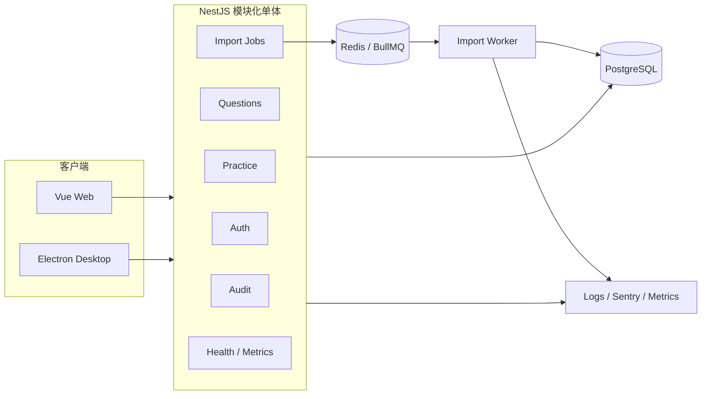
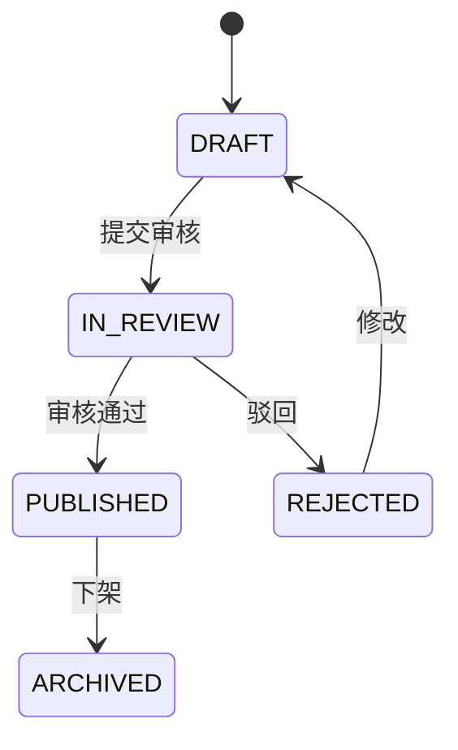
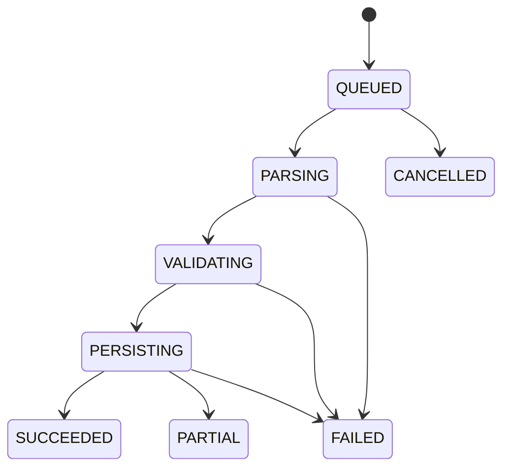
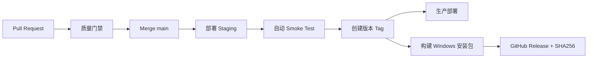
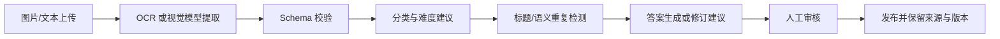

# 知识航线 V2：全栈进阶路线图

> 目标不是堆砌 Redis、JWT、消息队列等名词，而是把项目升级为一个有真实业务矛盾、明确架构选择、失败处理和验证证据的系统。

## 一、整体定位

### V1 已经解决了什么

- Vue 题库、筛选、刷题、自评、历史与统计闭环。
- NestJS + Prisma + PostgreSQL 云端题库。
- JSON 批量导入与应用层标题查重。
- Web/Electron 共用前端业务代码。
- 本地学习数据备份、迁移和桌面文件镜像。
- 网页、API 和 Windows 安装包三类产物发布。

### V2 要解决什么

把“一个人使用的题库工具”升级为：

**支持多用户独立学习、多人协作维护题库、可靠处理大批量导入，并能监控和自动发布的跨端学习平台。**

用户故事不再只是“我能刷题”，而是：

1. 学习者登录后，在网页和桌面端看到自己的进度、收藏和历史。
2. 编辑者可以提交或修改题目，但不能绕过审核直接发布。
3. 管理员可以审核题目、追踪修改人，并在错误发生后恢复版本。
4. 大文件或 AI 提取任务在后台执行，页面能看到进度，重复提交不会重复入库。
5. 两个人同时修改同一道题时，系统能发现冲突，而不是后保存的人悄悄覆盖前一个人。
6. 服务异常、任务堆积或错误率升高时，开发者能从日志、指标和告警中定位问题。
7. 每次合并代码都自动测试、构建和部署，失败版本不能进入生产环境。

### 推荐架构

**暂时不拆微服务。** 当前业务量和团队规模不需要承担服务发现、跨服务事务、分布式追踪和多套部署的成本。NestJS 模块化单体加一个独立 Worker，已经足以体现清晰边界和异步处理能力。

---

## 二、从参考简历中提取哪些能力

| 参考简历中的做法 | 背后的工程问题 | 在知识航线中的合理映射 | 是否推荐 |
| --- | --- | --- | --- |
| RabbitMQ + Celery 异步任务 | 长任务不能阻塞 HTTP，请求与执行要解耦 | BullMQ + Redis 处理图片/JSON/AI 导入任务 | 推荐，但等真实长任务出现再加 |
| 任务状态机 | 多步骤任务要能显示当前阶段并处理失败 | ImportJob：等待、解析、校验、写入、成功、部分成功、失败 | 强烈推荐 |
| 重试、熔断、幂等、锁 | 网络和进程会失败，重复请求不能重复执行 | 导入幂等键、唯一约束、有限重试、乐观锁 | 强烈推荐 |
| Redis 缓存与告警 | 热点读取和故障定位 | Redis 先用于队列和限流；缓存必须在压测后再加 | 不为名词硬加 |
| 前端行为与白屏监控 | 线上错误需要可复现、可定位 | Sentry + 路由、版本、requestId 上下文 | 推荐 |
| 发布订阅解耦模块 | 一个业务动作触发多个后续动作 | 题目发布后写审计、清缓存、通知；先用领域事件 | 有真实多订阅者时再做 |
| 自定义富文本能力 | 第三方组件不满足业务语义 | Markdown 编辑、预览与 XSS 清洗 | 可做，但不是主亮点 |
| AST 与知识影响分析 | 研发知识和代码变更风险治理 | 与题库主业务关系弱 | 不照搬 |
| worktree 对照实验 | 用实验验证改造效果 | 用集成测试、故障演练和压测验证可靠性 | 学方法，不照搬形式 |
| 具体成功率与效率数字 | 用结果证明价值 | 用真实压测、故障演练、CI 记录产生数字 | 测量后才能写 |

### 参考简历最值得学的结构

每一条都应包含四部分：

1. **业务问题**：为什么原方案不够。
2. **技术机制**：你实际采用了什么。
3. **关键权衡**：为什么没有选择另一种方案。
4. **验证结果**：测试、压测、故障演练或生产指标。

最不能学的是先写一个漂亮数字，再倒推解释。没有原始测试脚本、环境和报告的数字，不进入简历。

---

## 三、V2 阶段与进度

以完整 V2 为 100%，当前 V1 基础约占 **35%**。

| 阶段 | 核心能力 | 完成后进度 |
| --- | --- | ---: |
| 现有基础 | Web、API、数据库、Electron、练习闭环 | 35% |
| 1 | 用户认证与数据归属 | 50% |
| 2 | 个人学习数据云端化和跨端同步 | 60% |
| 3 | RBAC、审核、版本与审计 | 70% |
| 4 | 异步导入、状态机、幂等与重试 | 82% |
| 5 | 并发冲突与桌面离线同步 | 90% |
| 6 | 监控、告警、故障演练 | 95% |
| 7 | 完整 CI/CD 与发布治理 | 100% |

这不是按代码量划分，而是按可讲述的系统能力划分。

---

## 四、阶段 1：用户认证与数据归属

### 大白话

现在数据库知道“有哪些题”，但不知道“谁在使用”。如果直接把练习记录上传，所有人的记录会混在一起。第一步不是画登录页，而是让每条私人数据都有可信的主人。

### 正式概念

- 用户注册、登录、退出。
- 密码只保存哈希，推荐 Argon2 或 bcrypt。
- 短期 access token + 可撤销、可轮换的 refresh session。
- 服务端从认证信息中的 `sub` 获取用户 ID，不接受前端随意传入 `userId`。
- 401 表示未认证，403 表示已认证但无权限。

### 第一批数据表

- `User`：id、email、passwordHash、role、createdAt。
- `RefreshSession`：userId、tokenHash、expiresAt、revokedAt、deviceName。
- `PracticeRecord.userId`：练习记录所属用户。

### 安全存储策略

- Web：access token 只放内存，refresh token 使用 HttpOnly Cookie。
- Electron：令牌不暴露给 Vue 渲染进程，由主进程结合 `safeStorage` 保存。
- 生产环境最好让网页和 API 同源，减少跨站 Cookie 与 CORS 的复杂度。

### 你亲手完成的核心代码

1. Prisma 的 `User` 模型及其与 `PracticeRecord` 的关系。
2. `AuthService.validateUser()` 中密码校验的核心分支。
3. 一个所有权查询：只按 `id + userId` 查练习记录。
4. 分清 401 和 403 的接口测试。

安装依赖、迁移数据库、生成 Prisma Client 和启动服务由 Codex 完成。

### 立即可见的结果

- 注册两个账号。
- A 创建的练习记录，B 登录后看不到。
- B 猜中 A 的记录 ID 也无法修改。
- 退出后受保护接口返回 401。

### 面试价值

能讲认证、会话撤销、密码安全、对象级数据隔离，而不只是“用了 JWT”。

---

## 五、阶段 2：学习数据云端化与跨端同步

### 大白话

登录只是认出用户，还没有解决“网页和桌面看到同一份进度”。这一阶段把练习记录、收藏和个人笔记变成用户私有的云端数据，同时保留离线体验。

### 正式概念

- `PracticeRecord`、`Favorite`、`Note` 与 `User` 建立外键关系。
- 收藏建立 `(userId, questionId)` 联合唯一约束。
- 练习记录采用追加模型，重复练习产生新记录，不覆盖历史。
- 客户端生成 `clientRequestId`，服务端建立唯一约束，网络重试不会产生重复记录。
- 首次登录提供本地数据迁移预览，用户确认后上传。

### 你亲手完成的核心代码

1. 将当前 Pinia `practice` action 改为调用 API。
2. 为新增记录生成并携带 `clientRequestId`。
3. 编写“同一个请求重放两次，只产生一条记录”的测试。

### 立即可见的结果

- 网页作答后，桌面端登录同一账号能看到记录。
- 重复点击提交或网络重试不会产生两条相同记录。
- 两个账号的数据完全隔离。

### 面试价值

能讲数据所有权、幂等写入、本地迁移和跨端同步边界。

---

## 六、阶段 3：RBAC、审核、版本与审计

### 大白话

多人系统不能让任何登录用户都直接删除公共题库。学习者、编辑者和管理员应该拥有不同能力，关键修改还要知道“谁在什么时候改了什么”。

### 权限模型

| 角色 | 权限 |
| --- | --- |
| LEARNER | 刷题、保存自己的记录/收藏/笔记、提交纠错建议 |
| EDITOR | 新建草稿、编辑草稿、提交审核 |
| ADMIN | 审核发布、驳回、下架、管理角色 |

角色只是第一层，仍需对象级规则：

- 学习者只能修改自己的私人数据。
- 编辑者可以修改自己负责的草稿，但不能直接发布。
- 管理员可以发布，但关键操作必须写入审计日志。

### 题目生命周期

### 新增模型

- `Question.status`、`createdBy`、`updatedBy`、`version`。
- `QuestionRevision`：保存每次发布前后的快照、修改人和原因。
- `AuditLog`：actor、action、resource、metadata、createdAt。

### 你亲手完成的核心代码

1. `@Roles()` 装饰器和 `RolesGuard` 的判断。
2. `submitForReview()` 的合法状态迁移。
3. 一条审计记录的写入逻辑。

### 立即可见的结果

- 学习者看不到管理按钮，并且直接调用接口也会收到 403。
- 编辑者提交后题目进入“待审核”。
- 管理员可查看修改前后差异并发布或驳回。

### 面试价值

能讲 RBAC 与对象级授权的区别、服务端权限校验、工作流状态机和审计追踪。

---

## 七、阶段 4：异步导入、状态机、幂等与重试

### 大白话

几百道 JSON 直接导入很快，但图片 OCR、AI 答案生成和大批量校验可能需要几十秒。HTTP 请求一直等待容易超时，用户也不知道任务做到哪一步。因此接口只负责接单，Worker 在后台执行。

### 技术方案

- BullMQ + Redis 保存任务队列。
- API 创建 `ImportJob` 后立即返回 `202 + jobId`。
- Worker 执行解析、字段校验、查重、写入和结果汇总。
- 前端先轮询任务状态，稳定后可升级为 SSE 推送。
- 同一文件计算内容哈希，并结合用户生成幂等键。
- 只对网络超时等瞬时错误做指数退避重试，格式错误不重试。

### ImportJob 状态机

### 为什么先不用 RabbitMQ

项目是 Node/NestJS 技术栈，BullMQ 与 Redis 接入和维护成本更低，也足以支持重试、延迟任务、并发数和失败任务。面试中主动说明“为什么当前不需要 RabbitMQ”比硬加一个消息中间件更有判断力。

### 你亲手完成的核心代码

1. `ImportJobStatus` 状态枚举和合法迁移。
2. Worker 中“可重试错误”和“永久错误”的分类。
3. 幂等键冲突时返回已有任务，而不是创建新任务。

### 立即可见的结果

- 上传文件后页面马上获得任务编号并展示进度。
- 连续上传同一文件三次，只执行一次实际导入。
- 导入过程中停止 Worker，再启动后任务可以重试或恢复。
- 错误行会形成可下载报告，不再只有“导入失败”。

### 面试价值

能讲请求与任务解耦、状态机、幂等、错误分类、退避重试和最终一致性。

---

## 八、阶段 5：并发冲突与桌面离线同步

### 问题 1：两个编辑者同时修改同一道题

当前“最后一次保存覆盖前一次”的行为会让修改静默丢失。低冲突场景推荐乐观锁：

- `Question` 增加 `version`。
- 客户端提交自己读取时的 version。
- 服务端按 `id + version` 更新并让 version 加一。
- 更新数量为 0 时返回 409，让用户查看冲突并决定合并。

**为什么不用悲观锁：** 编辑时间可能很长，持续占有数据库锁会降低吞吐并产生锁等待；当前冲突概率低，乐观锁更合适。

### 问题 2：桌面离线后如何同步

- 本地每次操作写入 `SyncOperation` 队列。
- 操作具有客户端 UUID，服务端按 UUID 幂等消费。
- 练习记录采用追加策略，天然较少冲突。
- 收藏可按目标最终状态合并。
- 个人笔记使用 version 检测冲突，不能简单覆盖。
- 同步成功后再删除本地操作，不以“发出请求”视为完成。

### 你亲手完成的核心代码

1. Prisma 的 version 字段和条件更新。
2. 前端处理 HTTP 409 的冲突提示。
3. 一条离线操作从 pending 到 synced 的状态变化。

### 立即可见的结果

- 两个窗口同时编辑同题，第二个保存者看到冲突提示。
- 断网时桌面仍能作答；恢复网络后自动补传且不重复。

### 面试价值

这是项目最有区分度的部分之一，可以讲乐观锁、幂等、离线队列、冲突策略和最终一致性。

---

## 九、阶段 6：监控、告警与故障演练

### 大白话

“我的电脑上能跑”不等于线上可靠。系统出错后必须知道哪次请求、哪个用户、哪个版本、哪个任务失败，以及是否已经影响大量用户。

### 最小可观测体系

- **结构化日志**：Pino JSON 日志，包含 requestId、route、status、duration、userId、jobId。
- **错误追踪**：前后端接入 Sentry，关联发布版本和 requestId。
- **健康检查**：`/health/live` 检查进程，`/health/ready` 检查 PostgreSQL 和 Redis。
- **业务指标**：请求量、5xx、p95 延迟、导入成功/失败数、任务耗时、队列深度、同步冲突数。
- **审计日志**：管理员发布、删除、改角色等安全相关操作独立记录。

### 可执行告警

- 5 分钟 5xx 比例超过真实基线阈值。
- API p95 延迟持续超过阈值。
- 导入失败率持续升高。
- 队列积压超过阈值并持续 10 分钟。
- readiness 检查失败。

阈值先通过压测和一段时间的运行数据确定，不能凭空写进简历。

### 故障演练

1. 主动断开 Redis，确认 API 仍能提供非导入功能，导入接口明确降级。
2. 导入中杀掉 Worker，确认任务不会静默丢失。
3. 制造数据库连接失败，确认 readiness 失败并触发告警。
4. 前端主动抛错，确认 Sentry 能关联版本和页面路由。

### 你亲手完成的核心代码

1. requestId 中间件。
2. ImportJob 成功/失败指标计数。
3. readiness 中数据库和 Redis 检查。

### 面试价值

能讲日志、指标、错误追踪的区别，以及如何通过故障演练证明告警真的有效。

---

## 十、阶段 7：完整 CI/CD 与发布治理

### Pull Request 必须通过

1. 格式与 Lint。
2. 前端单元测试。
3. 后端单元和 API 集成测试。
4. GitHub Actions service container 启动 PostgreSQL 与 Redis。
5. Prisma schema 校验和迁移测试。
6. Playwright 完成登录、刷题、导入任务的冒烟流程。
7. Web、Server、Electron 构建。

### 主分支和发布标签

### 数据库发布策略

- 使用 `prisma migrate deploy`，不在生产环境使用 `db push`。
- 采用 expand-contract：先增加兼容字段，再迁移数据，最后删除旧字段。
- 应用回滚到上一个镜像；数据库迁移尽量向后兼容，避免把“回滚”等同于直接逆向删列。
- GitHub Environments 管理 staging/production 密钥和生产审批。

### 你亲手完成的核心代码

1. 一段 GitHub Actions 测试 job。
2. 一个 Playwright 登录并刷题的 smoke test。
3. 一次故意让测试失败，观察 PR 被阻止合并。

### 立即可见的结果

- 失败代码无法合并。
- main 自动进入 staging 并接受冒烟验证。
- 打 tag 自动生成版本、安装包和校验文件。
- 能展示一次失败发布和回滚记录。

### 面试价值

能讲质量门禁、环境隔离、迁移策略、制品、发布与回滚，而不是只说“用了 GitHub Actions”。

---

## 十一、AI 题库处理如何加，才不是套壳

这是参考简历中 LLM 编排最适合映射到本项目的方向，但应放在异步导入基础完成之后。

### 推荐流程

### 必须具备的约束

- 模型输出永远先进入草稿，不能直接污染正式题库。
- 每道题保存来源、模型版本、生成时间和审核人。
- JSON Schema 做确定性校验，LLM 只处理语义任务。
- 答案验证要保留引用或人工审核状态，不能声称模型“保证正确”。
- 记录 token、耗时、失败原因和重试次数。
- 对截图来源和公开分发范围进行版权核查。

### 能形成的亮点

不是“调用了大模型 API”，而是：

- 将不可靠模型输出纳入可恢复的任务状态机。
- 用确定性校验、版本、来源和人工审核约束生成内容。
- 对重复、超时、限流和部分失败建立处理策略。

---

## 十二、完成后可以写进简历的版本

> 以下内容只能在对应功能、测试和证据全部完成后使用，方括号数字必须替换为真实测量结果。

- **多用户与权限体系：** 基于 NestJS Guard 实现 access/refresh 会话、令牌轮换及 LEARNER/EDITOR/ADMIN 三级 RBAC，并在 Service 层执行对象级所有权校验；将练习记录、收藏和笔记迁移为用户私有云端数据，覆盖 401、403 与跨用户越权测试。
- **可靠异步导入：** 使用 BullMQ + Redis 将图片/JSON/AI 题库处理从 HTTP 请求解耦为后台任务，设计 ImportJob 状态机、内容哈希幂等键、错误分类与指数退避重试，通过轮询/SSE 展示进度和错误行报告；故障演练验证 Worker 重启后任务可恢复。
- **并发与跨端同步：** 通过数据库唯一约束、事务和 Question version 乐观锁防止重复入库与并发覆盖；Electron 使用本地操作队列和客户端 UUID 完成断网作答、恢复补传及服务端幂等消费。
- **可观测性与交付：** 建立 requestId 贯穿的结构化日志、Sentry 错误追踪、数据库/Redis readiness 和导入业务指标；GitHub Actions 使用 PostgreSQL/Redis service container 执行单元、集成和 Playwright 冒烟测试，并自动发布 staging、生产 API 与带校验值的 Windows 安装包。

### 可量化但必须实测的指标

- 1000 道题导入耗时、成功率与重复过滤数。
- Worker 中断后恢复成功率。
- 重复提交 N 次后数据库实际新增数。
- k6 固定并发下 API p50/p95/p99 和错误率。
- CI 平均耗时、失败拦截次数。
- 发布后告警发现时间和故障恢复时间。

不要写用户量、降本比例或生产成功率，除非确实有原始数据。

---

## 十三、推荐实施顺序

### 第一轮：最高性价比，先做到可投递

1. 数据库唯一约束和后端集成测试。
2. 用户注册登录、会话和数据所有权。
3. 练习记录云端化、两个账号隔离。
4. RBAC + 题目审核状态机 + 审计日志。
5. Sentry、健康检查和基础 CI 门禁。

完成这一轮，项目已经能稳定写“多用户全栈平台”，预计达到 V2 的 **70% 到 75%**。

### 第二轮：形成明显区分度

1. BullMQ + Redis 异步导入。
2. ImportJob 状态机、幂等、重试和错误报告。
3. 乐观锁与 409 冲突处理。
4. Electron 离线操作队列与恢复同步。
5. 监控指标、告警、故障演练和完整发布流水线。

### 第三轮：有余力再做

1. AI 图片题库提取与人工审核。
2. 间隔重复算法和个性化复习计划。
3. Electron 自动更新与代码签名。

## 下一步只做一个小点

**先做“数据属于谁”，不先做登录页面。**

下一次教学从整体数据流开始，然后只让你亲手完成 Prisma `User` 模型及 `User -> PracticeRecord` 的关系。保存并执行迁移后，我们会直接在 Prisma Studio 中看到新表，再进入注册接口。这样你写下的第一段代码就对应多用户架构的根基，而不是机械复制一整套登录模块。
