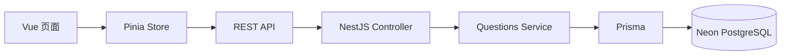
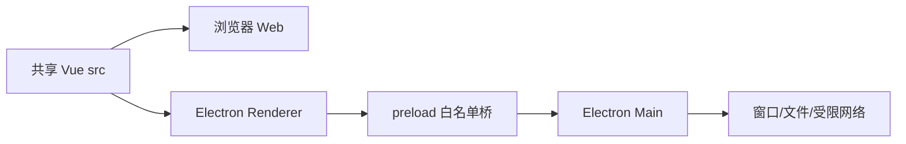

# 知识航线：简历描述与面试追问

> 这份笔记只保留仓库中真实存在、能够定位到代码和部署产物的能力。不能讲清楚的功能先不写，尚未实现的功能绝不包装成已完成。

## 一、先说结论：这个项目够不够资格上简历

**够。** 对前端或全栈实习岗位，它已经不是“跟着教程写的增删改查”，而是一个经历了明确架构演进的个人项目：

1. 从 Vue 单页应用和 `localStorage` 单机存储起步。
2. 形成题库导入、查重、分类筛选、作答、自评、历史和统计的学习闭环。
3. 使用 NestJS、Prisma、PostgreSQL 把题库主数据迁移到服务端，并补齐 User、RefreshSession、RBAC 和个人学习数据隔离。
4. 使用 Electron 复用同一套 Vue 业务代码，交付网页和 Windows 安装包。
5. 处理浏览器与 Electron 存储隔离、数据迁移、IPC 权限边界、分片上传、异步 ImportJob 和协作审核。

真正值得写的不是“有上一题按钮”“用了 computed”“页面有热力图”，而是下面四件事：

- **全栈数据架构**：前端不再独自保存题库，服务端成为题库主数据来源。
- **批量数据治理**：统一 JSON 协议、校验、归一化查重，并反馈新增/跳过数量。
- **跨端代码复用与安全边界**：Web 和 Electron 共用 `src/`，系统能力通过受限桥接暴露。
- **用户数据迁移**：保留原有学习进度，并为本地数据建立版本化备份和桌面文件镜像。

### 客观水平

- **投前端实习**：有竞争力，前提是能讲清状态管理、数据流、跨端适配和测试。
- **投全栈实习**：可以写，后端已经覆盖鉴权、数据库约束、事务、权限、上传和可观测性；需要如实说明本地演示边界。
- **投中高级岗位**：当前仍不够。Redis/BullMQ、独立 Worker 和真实浏览器 E2E 只完成了本地验证；对象存储、长期指标告警、线上 CI/CD 和发布演练尚未完成。

它不会因为“题库”这个题材被一眼判为低质量。面试官真正判断的是：你解决了什么工程问题、为什么这样设计、你是否知道当前方案的边界。

---

## 二、可直接放进简历的版本

### 知识航线 - 全栈跨端面试题库与学习工具

**技术栈：** Vue 3、Pinia、Vue Router、Vite、NestJS、Prisma、PostgreSQL、Redis、BullMQ、Electron、Playwright

**项目简介：** 面向技术面试复习场景的跨端学习工具，提供分层题库筛选、作答自评、错题回顾、学习统计和批量题库维护，同时交付 Web 版与 Windows 桌面版。

- **学习闭环：** 基于 Vue 3 Composition API、Pinia 和 Vue Router 组织题库、练习与统计模块，实现分类/标签多级筛选、书面作答、答案对照、可修改自评、历史记录和每日活跃统计，并以题目 ID 关联题库与练习记录，避免重复作答覆盖历史。
- **全栈数据架构：** 将题库主数据从浏览器 `localStorage` 迁移至 NestJS REST API、Prisma 与 Neon PostgreSQL，统一处理题目查询、增改删和批量导入；前端通过 Pinia action 收口异步请求，并保留请求失败时的本地题库回退能力。
- **批量导入与查重：** 设计 `schemaVersion: 1` 的 JSON 题库协议，使用 DTO 校验输入，并通过 `trim + lowercase + Set` 同时过滤数据库已有题目和单次导入中的重复标题；数据库唯一索引作为并发最终防线，E2E 验证重复请求不会产生脏数据。
- **登录、权限与个人数据：** 使用 bcrypt、短期 Access Token、HttpOnly Refresh Cookie、Electron `safeStorage`、AuthGuard/RolesGuard 和 Service 层所有权校验；练习记录以 `(userId, clientRequestId)` 幂等，收藏和备注按用户隔离，管理员操作写入审计日志。
- **可靠上传与异步导入：** 使用 Blob 分片、Web Worker SHA-256、XHR/Electron IPC 字节进度、并发池、有限重试、AbortController、IndexedDB 和本地文件合并；Playwright 在 37% 暂停后关闭整个 Chromium/Electron 进程并复用 profile，验证同一会话只补传缺片。上传完成后创建幂等 ImportJob，通过 SSE 与 `Last-Event-ID` 恢复进度。本地 Redis + BullMQ 独立 Worker 已验证并发限制、错误分级重试和进程退出恢复；文件仍保存于本地目录，不能包装成生产对象存储。
- **协作一致性与可观测性：** Question 使用 version 乐观锁、QuestionRevision 快照和状态迁移白名单，409 页面保留本地/服务器版本；Pino 输出 requestId、route、status、duration、userId/jobId，健康检查与指标端点提供可重复的本地验证证据。
- **跨端复用与数据迁移：** Electron 与 Web 共用同一套 `src/` 业务代码，仅在主进程和 preload 层封装窗口、文件及网络能力；启用 `contextIsolation`、IPC 白名单和 API 域名白名单，并通过版本化全量备份及 `%APPDATA%` 文件镜像保留用户原有学习记录。Playwright 已真实验证 Web 写入、Electron 读取、桌面进程重启后的加密会话恢复，以及 Chromium/Electron 上传进程重启续传；当前本地验收为前端 74/74、后端单测 6/6、独立 PostgreSQL E2E 56/56、Worker 5/5、Playwright 6/6。

### 极简版（简历空间不足时）

- 使用 Vue 3、Pinia、Vue Router 实现题库筛选、作答自评、历史回顾与学习统计闭环，以稳定题目 ID 关联多次练习记录。
- 使用 NestJS、Prisma、PostgreSQL 将题库从单机存储迁移至服务端 REST API，设计版本化批量导入协议，并以归一化标题、数据库唯一约束和 `Set` 完成批内、库内及并发查重。
- Web 与 Electron 共用 Vue 业务代码，通过 preload/IPC 白名单隔离系统能力；实现 `localStorage` 全量迁移和 `%APPDATA%` 持久化，交付网页、API 与 Windows 安装包。
- 通过 bcrypt/JWT/RBAC、用户级幂等练习记录、分片上传、BullMQ ImportJob 和独立 Worker 形成可验证的全栈演进；Redis 与浏览器 E2E 仅有本地证据，对象存储和线上交付仍明确标注为未完成。

### 项目链接

- GitHub：<https://github.com/wqf12314-spec/question-bank-app>
- 在线体验：<https://wqf12314-spec.github.io/question-bank-app/>
- 在线 API：<https://question-bank-api-2vsg.onrender.com>
- Windows Release：<https://github.com/wqf12314-spec/question-bank-app/releases/tag/v1.0.0>

---

## 三、为什么这些内容有简历价值

### 1. 学习闭环不是页面堆砌

**大白话：** 用户不是“看过一道题”就结束了，而是要筛题、自己回答、对照答案、评价掌握程度、回看以前的错误，再从统计中看到进度。

**正式概念：** 这是围绕领域流程建模。题目是主实体，练习记录是按时间追加的行为实体，两者通过 `questionId` 关联。统计数据由题目和练习记录派生，不另外保存一份容易过期的统计结果。

**为什么这样设计：**

- 一道题可以重复练习，不能把“最近一次结果”直接塞进题目对象后覆盖旧记录。
- 自评允许修改，因此记录同时保存 `practicedAt` 和 `updatedAt`。
- 掌握数按每道题的最新记录计算，练习次数则保留全部记录，两个指标含义不同。

**替代方案：** 把 `status`、`userAnswer` 直接放在题目对象中。

**权衡：** 当前记录仍在本地，简单、隐私好、离线可用，但不能自动跨设备同步。

**代码证据：**

- [练习记录 Store](./src/stores/practice.js)
- [统计派生逻辑](./src/utils/statistics.js)
- [刷题页面](./src/views/PracticePage.vue)
- [练习历史组件](./src/components/ReviewHistory.vue)

### 2. 后端的意义不是“多了一层代码”

**大白话：** 第一版的题库只存在某个浏览器里，换浏览器或换设备就是另一份。第二版把题库放到统一数据库，网页和桌面都读同一个题库；以后修正一道题，不需要每个用户分别导入。

**正式概念：** 题库主数据由服务端集中管理，形成 `Vue -> REST API -> NestJS Controller -> Service -> Prisma -> PostgreSQL` 的数据链路。前端 Pinia Store 负责页面状态与请求编排，Controller 负责 HTTP 边界，Service 负责业务规则，Prisma 负责数据访问。

**为什么这样设计：**

- 多端共享一份题库主数据。
- 校验和查重规则集中在服务端，不能只信任前端。
- Controller、Service、数据访问层职责分开，更容易测试和替换实现。

**替代方案：** Supabase/Firebase、浏览器 IndexedDB、直接在 Vue 中访问数据库。

**权衡：** 自建 NestJS API 学习价值和可控性更高，但增加了部署、环境变量、CORS、数据库迁移和服务冷启动成本。

**代码证据：**

- [前端题库 Store](./src/stores/questions.js)
- [Controller](./server/src/questions/questions.controller.ts)
- [Service](./server/src/questions/questions.service.ts)
- [Prisma Schema](./server/prisma/schema.prisma)
- [Render 部署配置](./render.yaml)

### 3. 查重是数据一致性问题

**大白话：** 用户第二次导入题库时，只应该加入新题，不能把已有题再复制一遍。

**正式概念：** 现有实现先把标题 `trim()` 并转小写，建立 `Set`；导入时边判断边写入集合。因此既能排除数据库已有标题，也能排除本批文件内部的重复标题，时间复杂度约为 `O(n + m)`。

**为什么用 Set：** `Set.has()` 平均为常数级查找，比每道新题都对整个旧数组使用 `find/includes` 更适合批量导入。

**替代方案：** 数据库增加 `normalizedTitle` 字段和唯一索引，使用事务或 upsert 完成最终约束。

**当前权衡和缺陷：**

- `Question.normalizedTitle` 的数据库唯一索引是最终防线，Service 捕获唯一冲突并返回明确重复结果；E2E 已验证 10 个并发请求最终只有一条记录。
- 应用层 `Set` 仍用于提前识别库内和批内重复，减少无意义写入；它不能替代数据库约束。
- `trim + lowercase` 不能识别标点、连续空格不同但语义相同的题目，更不能识别语义重复。
- 语义去重只能作为导入审核候选，不能无条件自动删除；否则会把表达相近但考点不同的题目误合并。

**代码证据：**

- [前端归一化与查重](./src/utils/questionTransfer.js)
- [后端批量导入](./server/src/questions/questions.service.ts)
- [导入 DTO](./server/src/questions/dto/import-questions.dto.ts)

### 4. Electron 的重点是复用和权限隔离

**大白话：** 桌面版没有重新复制一套页面。题库、刷题和统计还是同一套 Vue 代码，Electron 只负责网页做不到的窗口、文件和系统能力。

**正式概念：** 采用共享渲染层的跨端架构。Electron 主进程持有 Node.js 和操作系统权限，渲染进程运行 Vue；preload 使用 `contextBridge` 暴露有限 API，并通过 IPC 调用主进程。

**为什么不让 Vue 直接使用 Node：** 渲染进程会处理页面内容，若拥有完整 Node 权限，XSS 可能升级为本地文件或系统命令风险。`contextIsolation` 和最小 API 暴露用于缩小攻击面。

**替代方案：** 两套独立前端、Tauri、PWA。

**权衡：** Electron 开发和复用成本低、生态成熟，但安装包和内存占用通常高于 Tauri；共享代码也需要显式隔离浏览器和桌面环境差异。

**代码证据：**

- [Electron 主进程](./electron/main.cjs)
- [preload 桥](./electron/preload.cjs)
- [桌面数据适配](./src/utils/desktopData.js)
- [桌面紧凑壳层](./src/components/DesktopShell.vue)
- [共用构建配置](./package.json)

### 5. 数据迁移比“换个存储位置”更重要

**大白话：** 浏览器里的学习记录不会自动跑进桌面版，因为两边的 `localStorage` 不是同一个抽屉。必须显式导出、校验、恢复，并确保 Store 读取数据前迁移完成。

**正式概念：** 本地数据使用带 `schemaVersion` 的版本化快照，导出全部 `localStorage` 键；Electron 启动时从 `%APPDATA%\知识航线\learning-data.json` 恢复，运行期间对本地写入做节流镜像。恢复动作需要发生在 Pinia Store 初始化之前，否则 Store 已经把旧值读进内存。

**为什么导出全部键：** 练习记录、界面偏好等可能分散在多个 key 中。只导出题库会造成“题目还在，但进度丢了”的半迁移。

**替代方案：** 全部数据云端化，登录后由服务端同步；或者桌面端直接使用 SQLite。

**权衡：** 当前方案无需账号、隐私和离线体验较好，但本地文件与浏览器仍不是实时双向同步，冲突合并也尚未实现。

**代码证据：**

- [版本化备份与恢复](./src/utils/localDataTransfer.js)
- [桌面文件镜像](./src/utils/desktopData.js)
- [数据导入导出组件](./src/components/DataPortability.vue)
- [数据迁移测试](./tests/local-data-transfer.test.js)

---

## 四、60 秒项目介绍

> 我做的是“知识航线”，一个技术面试题库和练习工具。它最初是 Vue 3 加 localStorage 的单机项目，后来把题库和登录后的练习数据迁移到 NestJS、Prisma 与 PostgreSQL，并补齐 Refresh Token、RBAC、用户级幂等和审计。Web 与 Electron 共用同一套 Vue `src`，系统能力只通过受限 preload/IPC 暴露。大文件链路使用 Web Worker Hash、XHR 分片进度、IndexedDB 断点恢复和服务端完整性校验，上传完成后由 Redis/BullMQ 独立 Worker 异步导入，前端用 SSE 和 Last-Event-ID 恢复任务进度。当前这些能力都在独立测试库和本地 Redis 上有自动化证据，但对象存储、线上 Redis、高可用与生产迁移仍未完成。

---

## 五、面试官高概率追问

### 追问 1：既然后端有数据库，为什么练习记录还存在 localStorage？

**回答：** 访客模式仍把练习记录保存在本地，避免强迫注册并保留离线体验；登录后则通过 PracticeRecord API 写入服务端，并由 AuthGuard 和 Service 层从令牌身份确定 `userId`。`(userId, clientRequestId)` 唯一约束防止连点和网络重试产生重复记录。当前缺口不是“没有云端练习记录”，而是 Web 与 Electron 连续操作的真实双端验收和完整离线同步冲突策略。

### 追问 2：为什么不把所有业务都写在 Vue 组件里？

**回答：** 组件负责交互和展示，Pinia Store 负责跨页面共享状态与异步动作，纯函数工具负责筛选、统计和查重，后端 Service 负责服务端业务规则。这样同一规则可以被多个页面复用，也能脱离 DOM 单独测试。小项目全部写组件更快，但随着导入、练习、统计和桌面端增加，会产生重复代码和难以测试的问题。

### 追问 3：`questions.value` 为什么需要 `.value`？

**回答：** `questions` 是 Composition API 的 `ref`。JavaScript 中 ref 是带 `value` 属性的响应式包装对象，修改 `.value` 才能被 Vue 追踪；模板会自动解包，所以模板中通常直接写 `questions`。Pinia setup store 对外使用时还会做一层自动解包，但在 Store 内部仍按 ref 规则访问。

### 追问 4：导入查重能保证绝对不重复吗？

**回答：** 不能。当前 `Set` 能处理单请求中的批内重复和当时数据库中已有标题，但它是应用层的先查后写，并发请求仍可能竞态。真正的最终一致性应由数据库规范化字段的唯一索引兜底，再捕获唯一约束冲突；批量操作还应结合事务或数据库原生 upsert。

### 追问 5：为什么恢复数据一定要在 Pinia 初始化前？

**回答：** Store 创建时就会从 localStorage 读取数据。如果先创建 Store 再恢复文件，内存中的响应式状态仍然是恢复前的旧值，并可能被 watch 再写回存储。先恢复、后初始化能保证 Store 第一次读取的就是迁移后的数据。

### 追问 6：Electron 的 `contextIsolation` 解决什么问题？

**回答：** 它隔离网页上下文与 preload 的特权上下文，避免页面脚本直接接触 Node/Electron 对象。项目只通过 `contextBridge` 暴露最小方法，主进程还会校验备份结构和 API origin。这样即使渲染层出现 XSS，攻击面也小于直接开启 `nodeIntegration`。

### 追问 7：为什么前端请求失败还回退到 localStorage？

**回答：** 这是兼容第一版数据和云服务不可用时的降级策略，避免页面直接空白。它提高了可用性，但也引入“云端与本地内容可能不同”的一致性问题，所以当前只能称为读取降级，不能称为完整离线同步。更成熟的方案需要缓存版本、同步队列和冲突策略。

### 追问 8：你的测试覆盖了什么，没覆盖什么？

**回答：** 当前本地验收为前端 Node 单测 74/74、后端单测 6/6、独立 PostgreSQL E2E 56/56、Redis/BullMQ Worker 集成测试 5/5、Playwright 6/6。覆盖数据库唯一约束、认证/RBAC、数据隔离、上传 Hash/配额/ZIP 安全、Worker 重试与退出恢复、SSE 断线恢复、乐观锁冲突页面、真实 Web/Electron 记录同步、Chromium/Electron 会话与上传进程重启恢复、完整页面状态、健康检查和 Redis 故障降级；Web、Electron renderer、NestJS 和独立 Worker 均构建通过。仍缺 MinIO/S3 Multipart、Sentry/长期指标、GitHub Actions 线上成功记录和生产故障演练，因此不能写成完整生产级测试体系。

### 追问 9：既然项目用了 Redis，为什么不顺手加一个分布式锁？

**回答：** 先找数据库无法表达的跨进程共享资源，再决定是否需要锁。本项目的题目、练习记录和 ImportJob 竞态都能由唯一约束、事务、幂等键和乐观锁仲裁；12 路并发创建同一 ImportJob 的 E2E 最终只有一个任务，所以增加业务锁只会引入 TTL、续租、崩溃释放和网络分区的复杂故障。BullMQ 自己的 Redis lock/stalled 机制只保证队列 job 的领取与恢复，不应包装成业务分布式锁。若未来必须锁住非幂等外部资源，需要 owner token、租约上限和 fencing token，且下游要拒绝过期持有者的旧 token。证据见 `docs/adr/0004-redis-lock-boundary.md`。

---

## 六、能写、有条件写、暂时别写

### 可以直接写

- Vue 3 + Pinia + Vue Router 的模块和状态组织。
- NestJS + Prisma + PostgreSQL 的 REST 数据链路。
- 版本化 JSON 批量导入、字段校验和归一化标题查重。
- 一题多次作答、可修改自评、历史记录与派生统计。
- Web/Electron 共享同一前端源码。
- contextIsolation、preload 白名单、IPC 和 API origin 校验。
- localStorage 备份迁移与 `%APPDATA%` 文件持久化。
- GitHub Pages、Render API、NSIS 安装包，以及本地 74 个前端单测、6 个后端单测、56 个独立 PostgreSQL E2E、5 个 Worker 集成用例和 6 个 Playwright 用例。
- 本地 Redis + BullMQ 独立 Worker 的入队、并发限制、错误分级重试、stalled 恢复和 Redis 故障降级。
- 本机环回条件下可重复的 96 MiB 上传基线与主线程/Worker Hash Long Task 对比；必须同时注明固定机器、固定 60 ms 延迟和非生产边界。

### 有条件写

- **“支持离线”**：只能说有本地读取降级和本地记录，不是完整离线同步。
- **“保证数据唯一”**：题目标题、练习请求和导入任务均有数据库唯一约束，并由 E2E 验证并发冲突结果。
- **“跨端数据共享”**：登录后的练习记录通过同一 API 按用户隔离；Playwright 已验证 Web 写入、Electron 读取和桌面进程重启恢复，但证据仍是本地测试环境。
- **“工程化部署”**：可以讲三类产物和构建流程，不要讲成成熟企业级 DevOps。
- **“高质量题库”**：题目数量不是技术亮点，且答案质量和版权来源需要持续审核。

### 暂时不要写

- 生产 Redis/BullMQ 高可用、对象存储 Multipart/预签名 URL和跨实例调度。
- Sentry、Prometheus 长期指标、staging/production 发布和生产迁移。
- 收藏系统，目前没有独立、完整的收藏 Store。
- 微服务、Docker/Kubernetes 等当前项目没有业务必要性的复杂基础设施。
- 高并发、高可用、百万数据量。
- 未测量的性能提升百分比、用户量、日活和业务收益。
- “100% 测试覆盖”或“完整 E2E 测试”。

---

## 七、不要作为独立简历亮点的内容

这些功能不是没价值，而是技术密度太低，只适合在面试展开业务细节：

- 增加上一题、下一题按钮。
- 使用 `computed`、`watch`、`ref`。
- 页面使用 Grid/Flex 布局。
- 输入框、渐变、圆角和主题美化。
- 单独实现一个热力图。
- 实现最小化、置顶和窗口缩放按钮。
- 完成普通 CRUD。

正确表达方式是把它们放进更大的能力中，例如：

- 不说“用了 `watch`”，说“对练习记录变化进行本地持久化”。
- 不说“做了热力图”，说“从行为记录派生每日活跃统计”。
- 不说“做了按钮”，说“Electron 通过受限 IPC 提供窗口能力”。

---

## 八、参考简历的表达方式，哪些该学，哪些不能学

### 值得学习

- 先用一句话说业务问题，不要一上来罗列框架。
- 每条用“能力名称：技术机制 + 业务作用”的结构。
- 一个项目保留 3 到 4 条高密度亮点，而不是列十几个小功能。
- 每个技术名词后面都要能回答“为什么需要它”。

### 不能照抄

- 没有测量过程却写具体性能提升百分比。
- 使用不存在或无法解释的技术版本。
- 把普通 API 调用包装成复杂架构。
- 把个人项目写成拥有大量用户和生产流量。

本项目最稳妥的原则是：**宁可少写一条，也不要写一句无法从代码、测试或部署产物中证明的话。**

---

## 九、让项目再上一个档次的路线

### P0：投简历前必须补

1. 核查公开题目来源和授权，不把整理内容表述为原创，准备一套可公开分发的示例题库。
2. 保存 Playwright 报告或录屏，并练习一次完整数据流和至少两个失败场景的现场讲解。
3. 人工核对正式 Neon 的 `_prisma_migrations` 与实际表结构，未确认前不再部署迁移。

### P1：最值得面试深挖

1. 接入本地 MinIO 的 Multipart、预签名 URL 和服务端流式 Hash，再与当前本地文件 Transport 做同一套契约测试。
2. 把现有 Chromium 进程恢复与性能基线迁移到 MinIO Transport 和受控弱网环境，比较本地文件与对象存储结果。
3. 在 GitHub Actions 实际运行 Dependabot/CodeQL、Redis/MinIO service container 和 staging smoke test。
4. 建立可长期采集的指标、错误追踪和基于真实基线的告警，再做 PostgreSQL/Redis/对象存储故障演练。

### P2：有余力再做

1. 错题复习计划和间隔重复算法。
2. 导入任务预览、错误行报告和可撤销导入。
3. 日志、错误追踪、健康检查和基础监控。
4. Electron 自动更新与安装包签名。

当前已经可以如实描述为“本地验证过 Redis/BullMQ 独立 Worker 和浏览器/桌面进程上传恢复的多用户全栈项目”；只有完成 P1 后，才适合加上“生产对象存储、线上交付和跨实例高可用”相关表述。

---

## 十、投递前自检

- [ ] 我能不看代码画出前端、后端、数据库和 Electron 的完整数据流。
- [ ] 我能解释题库为什么上云，而练习记录为什么暂时留在本地。
- [ ] 我能写出 `Set` 查重的核心逻辑，并说明并发竞态。
- [ ] 我能解释 Controller、Service、Prisma 各自负责什么。
- [ ] 我能解释 `ref.value`、Pinia action 和派生统计。
- [ ] 我能解释 preload、IPC、contextIsolation 和域名白名单。
- [ ] 我能解释 schemaVersion，以及为什么先恢复数据再初始化 Pinia。
- [ ] 我知道当前测试覆盖边界，不虚构覆盖率。
- [ ] 我能现场打开网页、API、GitHub 和 Windows Release。
- [ ] 简历上的每一句都能在仓库中指出代码位置。

## 一句话底线

**这个项目已经能写进简历，但你要把自己定位为“完成了可验证的架构演进”，而不是“做出了一个成熟商业平台”。**
